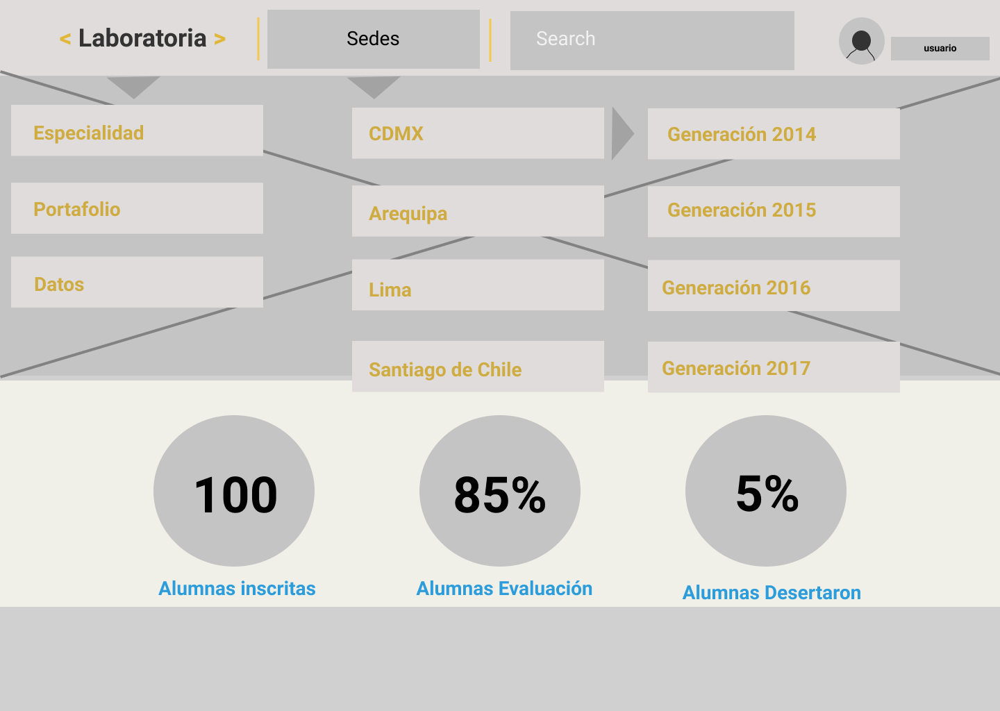

# Web de Laboratoria

## User Experience Design / UX

### 1.- Estudio del contexto, definir escenarios:
Proyecto orientado hacia países de Latinoamérica, este sitio web específicamente para México.

### 2.- Definir perfiles de usuarios:

##### Rango de edad;
Mujeres jóvenes de entre 20 y 35 años.
##### Nivel de escolaridad:
Educación media superior y superior.
##### Función o actividad principal:
Empleos mal remunerados, recién egresadas, desempleadas.
##### Medio ambiente en que se desarrolla el usuario, situación social, política y económica de su entorno:
México se encuentra en una transición histórica, las aspiraciones de la nación son alcanzar un régimen político democrático y un desarrollo económico equitativo, en el curso del siglo XX el país ha tenido un sistéma político no democrático que ha procreado una política autoritaria y un estilo de desarrollo económico que reprodujo y amplió la desigualdad social.
El progreso tecnológico en comunicaciones y trasnportes, ha modificado las formas tradicionales de organización laboral, la circulación y el consumo de bienes y servicios.
##### Necesidades de información, formación, nivel de experiencia sobre la disciplina  de interés: 
Mujeres con necesidad de desarrollar una carrera en el mundo tech, con un nivel de experiencia nulo en lenguajes de programación y desarrollo web.
Mujeres con motivación, persistencia, dispuestas a estudiar, aprender, superar los obstaculos socioculturales, ecónómicos de su contexto, y que desarrollan interés por la tecnología.

### 3.- Estudio de los Contenidos:

##### Primera sección informativa, Perfil de la aspirante;

Acerca del talento y potencial que cada aspirante a laboratoria puede desarrollar; “Talento que transforma”
“Ofrecemos transformación a las jóvenes que formamos y a las empresas que las contratan y que se capacitan con nosotros”
Y de la oprtunidad de desarrollar una carrera en tecnología,
“Postula. Aprende a programar y consigue un trabajo en el mundo tech”
Se anexa la descripción del programa, la metodología de aprendizaje, y los porcentajes de éxito.

##### Segunda sección informativa, Caso de éxito:

Testimonio de una egresada como caso de éxito laboral, para crear un puente narrativo entre la primera sección del perfil de aspirante con la tercera sección informativa, que serán las empresas.
“En Belcorp soy parte del equipo de Tecnología Digital… Sandra Azabache, egresada Laboratoria”

##### Tercera sección informativa para empresas:

“Talento tech. Contrata a nuestras egresadas”
Se anexa una reseña de los procesos de selección y formación de las alumnas, encaminadas a desarrollar habilidades para trabajar en equipos tecnológicos de alto rendimiento.  

##### Cuarta etapa, Caso de éxito de empresa:

Testimonio de empresa que ha contratado a gresadas de laboratoria, para crear un puente narrativo entre las empresas que contratan a egresadas y empresas que contratan capacitaciones.
“Estamos orgullosos de haber sido la primera empresa en contratar… Anand Kulkarni, CEO Crowdbotics”

##### Quinta sección informativa, Capacitación para empresas:

Información acerca de Design Thinking, y de experiencia como emprendedores y educadores en tecnología, ofreciendo capacitaciones para empresas.
“Desarrolla las habildades que tu equipo necesita para la era digital”
“Conoce nuestros cursos”

##### Sexta sección, Caso de éxito de capacitación:

##### Séptima sección, Impacto:
Datos duros acerca de graduadas, empresas, colocación laboral y satisfacción de empresas.

##### Octava sección, Aliados Regionales:Empresas aliadas relacionadas con tecnología; Google, Microsoft, etc.

##### Novena sección, Reconocimientos:
Reconocimientos que ha recibido el proyecto a nivel internacional.

##### Décima sección, Presencia en medios:
Ligas a artículos publicados en medios masivos de comuncación, a nivel internacional.

##### Blog:
Ligas a artículos en Medium, de autoría del equipo Laboratoria.

##### Seción final:
Contacto de Laboratoria, y liga para seguir el Blog.

### 4.- Modelo de negocio:

Se ofrece la oportunidad de ingresar a un Bootcamp presencial por seis meses, más dieciocho meses de Educación continua. Así como oportunidades laborales aseguradas para las egresadas, por lo cual se pagará el programa sólo si se les consigue un empleo.

Intención comunicativa del producto: Informar acerca del proyecto de Laboratoria, su misión, su visión y los resultados obtenidos, para obtener el registro de postulantes.
A la par de informar a las empresas del talento laboratoria, y de sumarse a la alianza laboral. Así como conocer los cursos y capacitaciones para empresas.

### 5.- Necesidades generales del proyecto:
Incidir en la brecha de género existente en la comunidad tech, capacitando a mujeres jóvenes para lograr posicionarse en actividades laborales relacionadas con desarrollo web.
Ganar postulantes para seguir con las etapas de educación en bootcamp y educación continua.
Crear alianzas laborales con empresas.

## User Interface / UI

Es la suma de una arquitectura de información + elementos visuales + patrones de interacción.

### 1.- Diseño de interacción (cómo responde el sistema):

-Palabras; están redactadas hablándole directamente al usuario/espectador, creando un diálogo directo. “Aprende, consigue, te has preguntado, comienza, etc”
Representaciones visuales, objetos físicos o espaciales; Textos cortosy claros, e imagen intercalada, un título, un párrafo de texto, una imagen, y se repite el ciclo.
-Comportamiento; Define las acciones de usuarios en reacción a la interfaz y cómo responden a él. En este caso es una web informativa que permite ir descubriendo información mientras se va avanzando, scroll.

### 2.- Diseño de elementos (botones, formularios);

En primera instancia se observa una barra principal con el título Laboratoria centrado, a la izquierda un botón de color amarillo “estudiantes” visiblemente más llamativo. A la derecha un segundo botón “empresas” de borde amarillo y color blanco.
Los botones principales que buscan atraer postulantes, son de color amarillo y se encuentran después de una breve reseña informativa de cada sección.

### 3.- Diseño visual (iconos, imágenes, tipografía) / Guías de estilo (paletas de color, fonts);
La página está dividida por secciones de información, la primera sección y más importante muestra una fotografía de egresadas mujeres, se muestran felices. Un texto centrado en letras mayúsculas para transmitir su importancia, color blanco y tipo de fuente negrita en contraste con la fotografía. Seguido del texto informativo en letras minúsculas, pequeños párrafos, tipo de fuente regular.

Sección dos, utiliza un fondo gris claro, el título está en mayúsculas , negritas, alternando colores amarillo y negro. Seguido del párrafo informativo en tipo de fuente regular y centrado.
Para rematar, un botón centrado de color amarillo, “comienza tu postulación”

En este punto se puede observar el ritmo en la composición de los elementos, se presenta una imagen que ocupa el ancho de a pantalla seguida de una sección de color blanco que contiene texto en contraste negro y amarillo, más un botón para postular, seas alumna o empresa.

La imagen sirve como descripción de los textos y como puente entre la narrativa de cada sección. Se describe a las alumnas, los casos de éxito tanto de alumnas como de empresas y se sigue la misma narrativa hasta terminar la descripción informativa.

En las imágenes se pueden ver a personas en entornos profesionales, ya que los textos ayudan a reafirmar estos conceptos.
La última imágen que aparece muestra a personajes públicos reconocibles, el ex-presidente Barack Obama, Mark Zuckerberg, Mariana Costa, que funcionan como descripción del impacto del proyecto a nivel internacional.

Los textos también llevan un ritmo, comienzan una frase corta descriptiva en letras mayúsculas y negritas, en contraste negro y amarillo, seguidas del párrafo en letra regular, contrastando con colores blanco y negro.
Los botones son rectangulares, sin bordes redondeados, mostrando una estructura esquemática acorde a las secciones divididas por imagen y color.

Los colores principales son; el amarillo, blanco y negro. El color amarillo en los títulos y en los botones es explotado para marcar jerarquía visual y está emparentado con el logo de Laboratoria.

La composición general está dividida en tres columnas, que son visibles en la barra de los primeros botones. Seguidas de los textos centrados, como en las últimas secciones con los íconos de aliados, reconocimientos y medios.

En la sección de blog, cada vista de artículo tiene los íconos para compartir en redes sociales, porque usualmente son un tipo de contenido que se comparte más facilmente, por contener una imagen principal como fachada y son de lectura rápida.

El footer es de color oscuro para delimitar la página, marcando su fin y mostrando datos de contacto por siq euda alguna duda por cubrir.

# ELEMENTOS DE NAVEGACIÓN EN GITHUB

##### Global
Es la navegación principal del site, normalmente es persistente y nos ayuda a explorar todas las opciones del site.
En Github se muestra en una barra de navegación de color oscuro, el ícono principal dentro de un círculo pequeño, seguido delas opciones; Features, Business, Explore, Marketplace, Pricing.
En la parte derecha las opciones Sign in or Sign up, por si ya se es usuario o se desea registrar apenas.
En el footer o parte inferior, tambien está disponible información adicional, como Platform, Community, Company, Resources y cada una despliega opciones específicas.

##### Local
Es la navegación “localizada” a una página o vista. Ayuda al usuario a explorar esa vista en particular.
Cada una de las opciones de la barra, presenta información local al dar click, en Marketplace se despliegan herramientas para enriquecer el trabajo dentro de la plataforma, y cada una de las imágenes que representa a la herramienta, direcciona a una vista más completa de las especificaciones.

##### Facetada
Es la navegación a través de filtros no editables, definidos previamente por el sistema.
Estando dentro de una cuenta de usuario, se pueden visualizar los filtros no editables, como son la zona deOverview, Repositories, Stars, Followers, Following, que no están sujetas a cambio, si no para que el usuario siempre sepa a donde entrar para ver los repositorios creados, sus seguidores, sus favoritos, etc.

##### Filtrada
En este tipo de navegación le damos al usuario todos los resultados de la búsqueda y le damos una serie de opciones de filtros para que él mismo pueda filtrar.
En la sección Marketplace, al posicionarse en la opción Search, se puede escribir un nombre o una descripción, así como filtrar por categorías, Code quality, code review, continuous integration, etc. Estas opciones permiten refinar la búsqueda de información.

##### Suplementaria
Es la navegación adicional, a veces temporal, utilizada para señalar algunas funciones a nuevos usuarios.
En un primer acercamiento a la página principal de github, sin estar registrado, y al clickar sobre la barra de navegación en la opcion Features, se despliega una sección de texto “How developers work”  mostrando un ícono que representa que hay un video, seguido del texto “New to Github? See how it works”. Al clickar sobre el ícono muestra un video como primer acercamiento para saber qué es Github y cómo se utiliza, mismo que está disponible sólo para usuarios nuevos.

# Sketch dashboard de laboratoria

